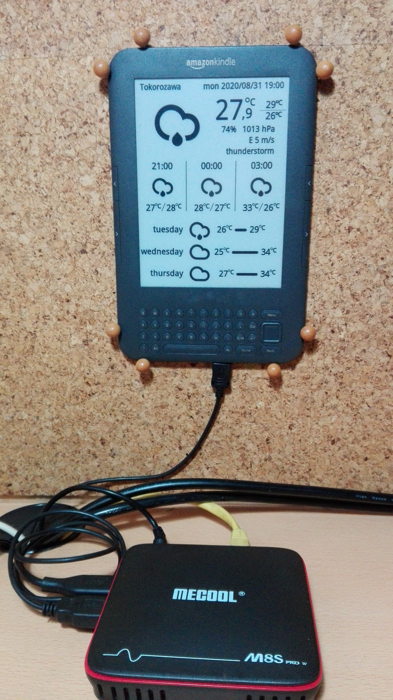

# kindle-weather-display

This repo is display weather information on old kindle 3, based on the original work by [Kindle-weather-station](https://gitlab.com/iero/Kindle-weather-station).

## Features
* weather information is based on [OpenWeatherMap API](https://openweathermap.org/)
* current weather, 3 hour forecast and 3 day forecast
* any locales, languages and units

### Kindle 3 and TV-box (Armbian)

## Setup
### kindle
1. jailbreak your Kindle
2. copy kindle/kindle-weather to /mnt/us folder
3. setup cron
5. setup usbnet: rename to /mnt/us/usbnet/auto
4. optionally install kindle-debian, system can improve

### server
1. get free subscription plan from openweathermap.org
2. copy host-server/var/lib/kindle-weather-host to /var/lib
3. install packages and setup (ex. debian buster):

    image processors
    apt install imagemagick imagemagick-6-common imagemagick-6.q16 \
    imagemagick-common libgraphicsmagick-q16-3 libmagickcore-6.q16-6 \
    libmagickcore-6.q16-6-extra libmagickwand-6.q16-6 pngcrush
    
    web server
    apt install nginx-light
    
    firewall
    apt install shorewall
    
    font
    apt install fontconfig

4. setup font

    copy ttf font to /root/.fonts
    fc-cache -v -f
    
5. setup cron

## setting
edit settings.xml

## Option
* [kindle-debian](https://mega.nz/folder/4XAlBK7Y#cSr2Gq8KxL6LkRe4SB0hqQ)
