# Kindle Weather Display

This program is for a weather display on old Kindle 3 based on the original work by [Kindle-weather-station](https://gitlab.com/iero/Kindle-weather-station)

## Weather API

Following APIs are available:

- [OpenWeatherMap onecall API v2.5](https://openweathermap.org/) (Free Tier)
  - Current weather
  - Hourly forecast for 48 hours
  - Daily forecast for 8 days
- [Tomorrow.io](https://www.tomorrow.io/) (Free Tier)
  - Hourly forecast for 120 hours
  - Daily forecast for 6 days

Note: OpenWeatherMap onecall API v2.5 will discontinue on july 1, 2024.
Subscribe to a v3.0 API.
 
## Screenshots

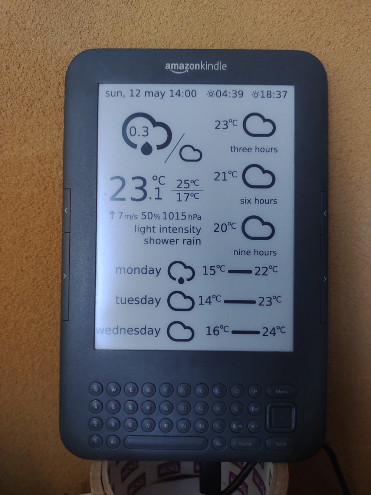&nbsp;

<kbd>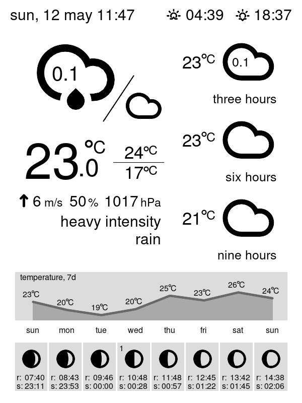</kbd>&nbsp;

## Requirements

- Jailbroken Kindle 3: https://wiki.mobileread.com/wiki/Kindle_Hacks_Information
- Server: Minimum 256M/100M OpenWrt router or SBC (e.g. OrangePi zero)
- Server OS: Openwrt, Ubuntu and Debian, etc which work with Python v3.11 or newer.
- Server's devices: USB port x1, LAN port x1
- WeatherAPI key
- API key on CloudConvert for online image converter (optional)
- user account on X (twitter) (optional)


## Create API key on CloudConvert (optional)

Create API key with the following options:

- user.read: View your user data 
- user.write: Update your user data 
- task.read: View your task and job data 
- task.write: Update your task and job data


## Kindle PNG format

kindle requires special PNG format. Converting process is as follows:

```
                                               [The server sends a PNG file to Kindle and displays it]
 SVG image ------------> PNG image ----------> flattened PNG image --> Kindle Dispaly
           converter:              converter:
           a)convert               a)convert
           b)gm
           c)rsvg-convert
           d)CloudConvert(online)
```
note:

`convert` is converter of ImageMagick.&nbsp;
`gm` is converter of graphicsMagick.&nbsp;
`rsvg-convert` is a commandline tool to render SVG documents to PNG images.&nbsp;
Both ImageMagick and graphicsMagick for Openwrt are lack of capabilities to manipulate SVG format.&nbsp;
Use CloudConvert.

## Set up server

### 1. Install the program

Copy `(github)/server/opt/lib/kindle-weather-station` to `(server)/opt/lib/kindle-weather-station`.

### 2. Set up user account

In config directory, edit `OWM_API_KEY.json` or `tomorrow_io_API_KEY.json`, `cloudconvert.json`(optional) and `twitter_ID.json`(optional)

### 3. Edit config files

Tempalate's names are `settings_*.json`.

Default config is `settings.json`.


### 4. Install Graphics converters, Python3 and modules.

#### Python3(v3.11 or newer) and module Requirements

- pytz
- requests
- setuptools
- pip
- cloudconvert (optional)
- twikit (optional, for twitter module)
- deep_translator (optional, for twitter module)
- qrcode (optional, for twitter module)
- hijridate (optional, for moon\_phase module)

e.g.) Openwrt
```
opkg update
opkg install python3 python3-pytz python3-requests python3-setuptools python3-pip
opkg install graphicsmagick
opkg install imagemagick
pip3 install twikit
pip3 install deep_translator
pip3 install qrcode
pip3 install cloudconvert
pip3 install hijridate
```

### 5. Network Time Synchronization

To retrieve data correctly, setup NTP server.

### 6. Test run

All set up finished, then try it.

`./CreateSVG.py` # use default config

or one of config files:

`./CreateSVG.py settings_######.json`

Take a look at `/etc/KindleStation_flatten.png`.


### 7. Install USB network

e.g.) Openwrt

```
opkg install kmod-usb-net kmod-usb-net-rndis kmod-usb-net-cdc-ether usbutils
```

## Set up Kindle

Connect a USB cable to both the server and Kindle.

USB cable uses for network and power supply.

### 1. Set up usbnet

The server: 192.168.2.1/24

Kindle    : 192.168.2.2/24 (fixed address)

```
                LOCAL NETWORK               USB NETWORK			
                e.g.(192.168.1.0/24)
 WAN <-> ROUTER <--------------> THE SERVER <------> KINDLE
                                 192.168.2.1/24      192.168.2.2/24
		
```

When usbnet setup is finished, access to Kindle. (no password)

```
ssh root@192.168.2.2
```

### 2. Set up ssh Auth key

- Create the server's pubkey.
- Set up the server's ssh client environment.
- Copy the server's ssh pubkey to Kindle.

e.g) dropbear

```
cd /etc/dropbear
dropbearkey -y -f dropbear_rsa_host_key | grep "^ssh-rsa " > dropbear_rsa_host_key.pub
mkdir /root/.ssh
cd /root/.ssh
ln -s /etc/dropbear/dropbear_rsa_host_key id_dropbear
cd -
scp dropbear_rsa_host_key.pub root@192.168.2.2:/tmp
ssh root@192.168.2.2  # access to Kindle
cat /tmp/dropbear_rsa_host_key.pub >> /mnt/us/usbnet/etc/authorized_keys
exit
ssh root@192.168.2.2  # test passwordless login
```


### 3. Test run

```
cd /opt/lib/kindle-weather-station
./kindle-weather.sh [config.json]
```

## Layout
Kindle display size is 600 x 800.
The program's layout is as follows:

| Module name       | Function                   | Size (Y-axis) |
|:------------------|:---------------------------|--------------:|
| maintenant        | Time information           | 40            |
| main              | Current and hourly weather | 480           |
| main2             | Current weather            | 340           |
| hourly            | Hourly weather             | 480           |
| daily             | Daily weather              | 280           |
| graph             | Graph  or tile             | 120           |
| twitter           | Alert (Twitter)            | 280           |
| daily_xlabel[6\\8]| Label on daily weather     | 20            |
| hourly_xlabel     | Label on hourly weather    | 20            |
| padding[-+0-9]*   | Insert spaces (Y axis only)|               |

Examples:
- maintenant + main + daily (40 + 480 + 280 = 800)
- maintenant + main2 + graph + \*\_xlabel + graph + \*\_xlabel + graph + padding20 (40 + 340 + 120 + 20 + 120 + 20 + 120 + 20 = 800)
- maintenant + main + graph + \*\_xlabel + graph + padding20 (40 + 480 + 120 + 20 + 120 + 20 = 800)
- maintenant + main + twitter (40 + 480 + 280 = 800)

### 1. maintenant

<kbd></kbd>&nbsp;

- config
  - "city": "Granada"
  - "sunrise\_and\_sunset": "False"

<kbd></kbd>&nbsp;

- config
  - "sunrise\_and\_sunset": "True"

### 2. main

<kbd>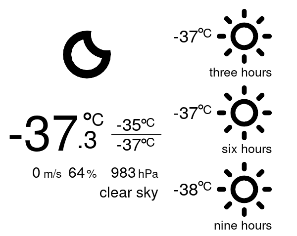</kbd>&nbsp;

- config
  - "timezone": "Pacific/Auckland"
  - "encoding": "iso-8859-1"
  - "locale": "en_US.UTF-8"
  - "lat": "-77.8400829" 
  - "lon": "166.6445298"
  - "units": "metric"
  - "lang": "en"


#### 2.1 Value in cloud icon

<kbd>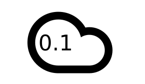</kbd>&nbsp;

- config
  - "in_clouds". : Value from 0 to 1.0 (0% to 100%)
     - "probability" : Probability of precipitation
     - "cloudCover" : Cloud thickness
     - "(empty)" : None

     
### 3. graph and tile

Available options are as follows:

- config: "graph\_objects"
  - "daily\_temperature": Daily Temperature
  - "daily\_rain\_precipitation": Daily Rain Precipitation
  - "daily\_snow\_accumulation": Daily Snow Accumulation
  - "daily\_weather": Daily Weather
  - "hourly\_temperature": Hourly Temperature
  - "hourly\_rain\_precipitation": Hourly Rain Precipitation
  - "hourly\_snow\_accumulation": Hourly Snow Accumulation 
  - "moon\_phase": Moon Phase

#### 3.1 graph 1: Daily Temperature and Moon Phase. (settings\_graph\_1.json)

<kbd>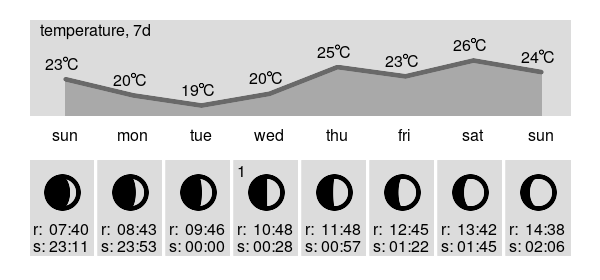</kbd>&nbsp;

- config
  - "graph\_objects": ["daily\_temperature", "moon\_phase"]
  - "ramadhan": "True"

#### 3.2 graph 2: Daily Temperature and Daily Precipitation. (settings\_graph\_2.json)

<kbd>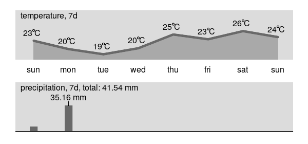</kbd>&nbsp;

- config
  - "graph\_objects": ["daily\_temperature", "daily_precipitation"]

#### 3.3 graph 3: Daily Weather and Moon Phase. (settings\_graph\_3.json)

<kbd>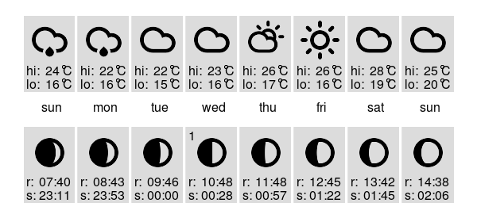</kbd>&nbsp;

- config
  - "graph\_objects": ["daily\_weather", "moon\_phase"]
  - "ramadhan": "True"

#### 3.4 graph 4: Hourly Temperature and Hourly Precipitation. (settings\_graph\_4.json)

<kbd>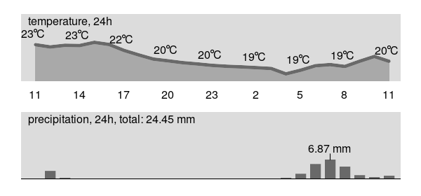</kbd>&nbsp;

- config
  - "graph\_objects": ["hourly\_temperature", "hourly\_precipitation"]

### 4. Twitter (WIP)

<kbd>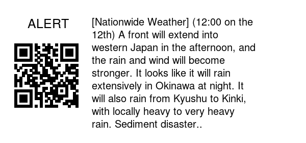</kbd>&nbsp;

- config
  - "twitter": {"caption": "ALERT", "screen\_name": "tenkijp", "translate": "True", "translate\_target": "en", "expiration": "3h", "alternate": \["graph", "daily\_xlabel[6|8]", "graph"\], "alternate_url": "https:\//tenki.jp/"\}
    - "screen_name": [@]Twitter Screen Name
    - "translate": If this option is "True", translate the text. 
    - "translate\_target": en(English), Other languages may work, but I haven't test them yet. See [deep-translator](https://pypi.org/project/deep-translator/).
    - "expiration": Valid within hours(h) or minutes(m), otherwise, use "alternate" layout.
    - "alternate\_url": If extract URL from Twitter failed, use "alternate_url".
  - "twitter\_keywords": {"include": "heavy,thunder,disaster", "exclude": "sakura,zakura"}
    - "include": If one of "include" keyword do match, display Twitter, otherwise, use "alternate" layout.
    - "exclude": If one of "exclude" keyword do match, use "alternate" layout. 

## Landscape e-Paper layout(WIP)

<kbd>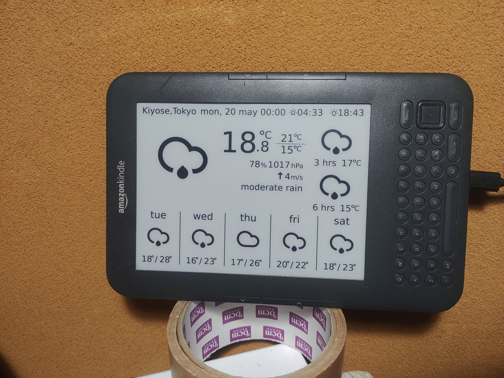</kbd>&nbsp;&nbsp;
<kbd>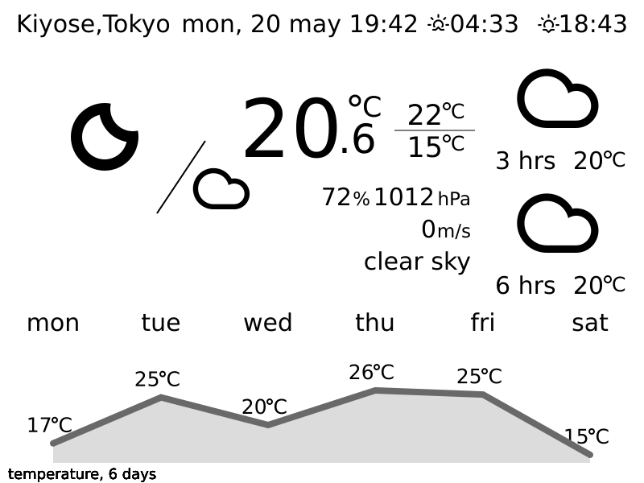</kbd>&nbsp;

Available module options are as follows:

- config: "graph\_objects"
  - "daily\_temperature\_landscape": Daily Temperature
  - "daily\_weather\_landscape": Daily Weather
  - "moon\_phase\_landscape": Moon Phase
- config: "layout"
  - ["twitter"] : X (former Twitter)
  
## Set up time schedule

Edit the server's crontab and restart cron.

e.g.)

`crontab -e`

```
0 */2 * * * sh -c "/opt/lib/kindle-weather-station/kindle-weather.sh 2>>/tmp/kindle-weather-station.err"
0 1-23/2 * * * sh -c "/opt/lib/kindle-weather-station/kindle-weather.sh /opt/lib/kindle-weather-station/settings_twitter.json 2>>/tmp/kindle-weather-station.err"
```

```
/etc/init.d/cron stop
/etc/init.d/cron start
```

# Credits

- [OpenWeatherMap](https://openweathermap.org/) , Weather API
- [Tomorrow.io](https://www.tomorrow.io/) , Weather API
- [CloudConvert](https://cloudconvert.com/) An online file converter
- [X (Twitter)](https://twitter.com/home?lang=en) Twitter, Inc. is an American social media company.
