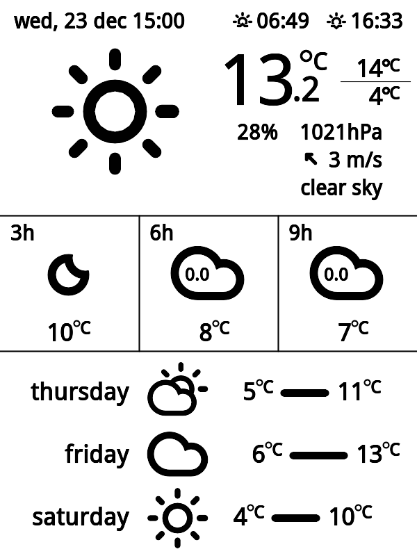
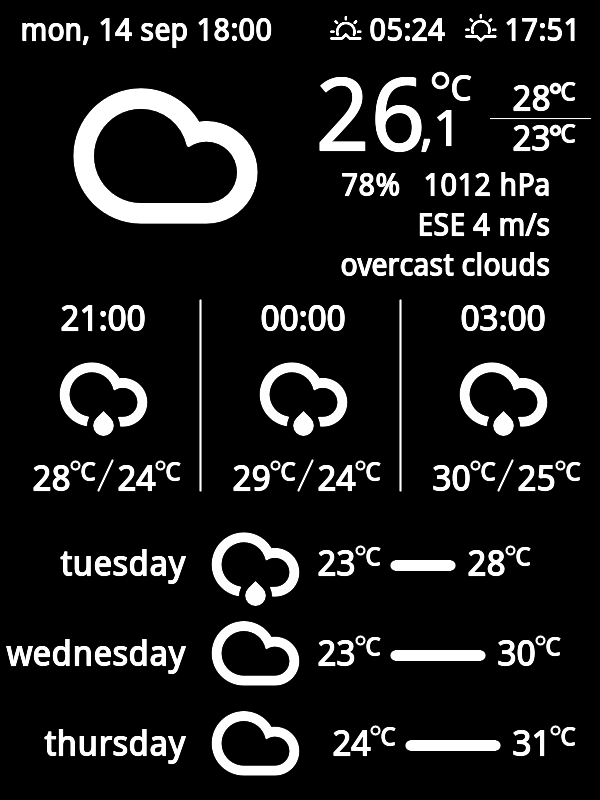
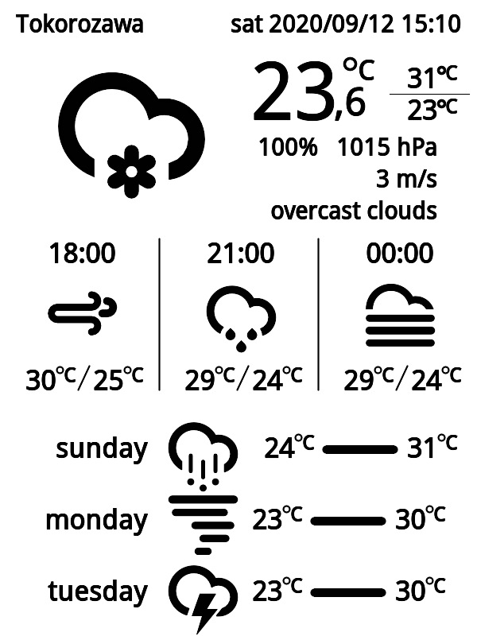
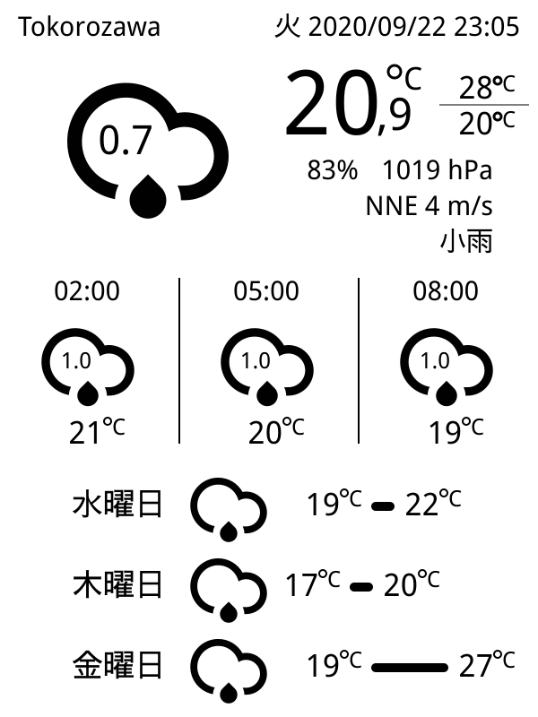

# kindle-weather-display

This repo is display weather information on old kindle 3, based on the original work by [Kindle-weather-station](https://gitlab.com/iero/Kindle-weather-station).

## Features
* weather information is based on [OpenWeatherMap API](https://openweathermap.org/)
* current weather, 3 hour forecast and 3 day forecast
* any locales, languages and units

### Kindle 3 and TV-box (Armbian)


## Setup

### kindle
1. jailbreak your Kindle and setup usbnet: https://www.mobileread.com/forums/showthread.php?t=149247
2. access to kindle via usbnet:
```
ip a add 192.16.2.1/24 dev usb0
ip link set usb0 up
ssh root@192.168.2.2 (no password)
```
3. create a directory:
```
mntroot rw
mkdir /www
mntroot ro
```
2. copy kindle-weather for kindle:
```
scp kindle/kindle-weather root@192.168.2.2:/tmp
ssh root@192.168.2.2 (no password)
mv /tmp/kindle-weather /mnt/us
```
4. edit /etc/fstab: 
```
tmpfs             /www          tmpfs  defaults,size=16m 0 0
```
5. setup cron: (example)
```
/etc/crontab/root
5,35 * * * * sh /mnt/us/kindle-weather/weather-script.sh
```
6. setup usbnet:
```
cd /mnt/us/usbnet
cp DISABLED_auto auto
mv DISABLED_auto DISABLED_auto.orig
```
7. disable kindle
```
/etc/init.d/powerd stop
/etc/init.d/framework stop
```
8. optionally install kindle-debian, system can improve

### server
1. get free subscription plan from openweathermap.org
2. setup usbnet: 
```
usbnet: /etc/network/interfaces
    
    auto usb0
      iface usb0 inet static
      address 192.168.2.1
      netmask 255.255.255.0
      broadcast 192.168.2.255
      network 192.168.2.0
```
3. copy kindle-weather-host for server:
```
cp -a host-server/var/lib/kindle-weather-host /var/lib
```
4. install packages and setup image processors, web server, firewall and ntp (eg. debian buster)
```
image processors:
    apt install imagemagick imagemagick-6-common imagemagick-6.q16 \
      imagemagick-common libgraphicsmagick-q16-3 libmagickcore-6.q16-6 \
      libmagickcore-6.q16-6-extra libmagickwand-6.q16-6 pngcrush

    web server:
    apt install nginx-light

    firewall:
    apt install shorewall
    
    EDIT: /etc/shorewall/interfaces
    choose the right interface
    
    ntp server:
    apt install ntp
```
5. install python3 modules: pytz, requests
6. setup font
```
    apt install fontconfig

    copy ttf font to /root/.fonts folder
    fc-cache -v -f
```
7. setup cron : (example)
```
/etc/cron.d/kindle-weather
0,30 * * * * root sh -c "/var/lib/kindle-weather-host/kindle-weather.sh"
```
## setting
Edit settings.xml

## internet access
Old system is potential security risk in general. But in the case of internet access is as followings:

### server
Enable masquerade or snat:
```
/etc/shorewall/snat

MASQUERADE		192.168.2.0/24		<interface>
```
systemctl reload shorewall

### kindle
```
ip route add default via 192.168.2.1
echo 'nameserver 8.8.8.8' >> /etc/resolv.conf

#test
ping google.com
```

### dark mode
If enable dark mode, edit settings.xml.
```
True: dark mode
False or None: light mode
Auto: automatic switch between light mode and dark mode according to the time of sunrise and sunset
```


### sunrise and sunset time
If enable sunrise and sunset time, edit settings.xml.
```
True: enable
False or None: disable
```

### extra icons
If adding extra icons or using different icon set, edit a python script. createSVG.py automatically uses extra icons.
Note: extra icons are not included due to complicated licenses.
```
EDIT: kindle-weather-host/extras/getextraicon.py
```



### using One Call API
Use createSVG2.py instead of createSVG.py.
Not all locations working.



### utf-8 encoding
Converting SVG to PNG with cloudconvert API due to limitations of Imagemagick.
* get any subscription plan from [cloudconvert.com](https://cloudconvert.com/). free plan for up to 25 conversions per day.
* pip3 install cloudconvert
* add api key to cloudconvert.json

### Option
* [kindle-debian](https://mega.nz/folder/4XAlBK7Y#cSr2Gq8KxL6LkRe4SB0hqQ)


